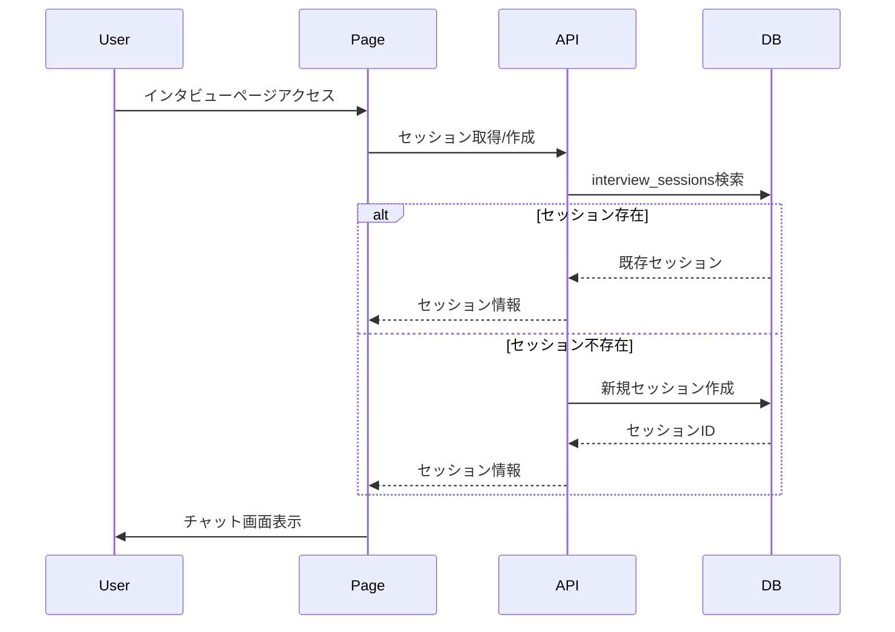
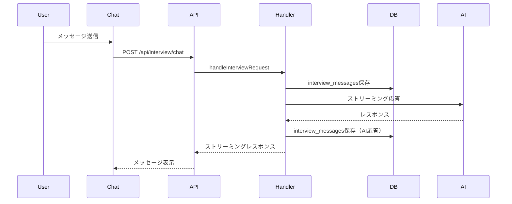
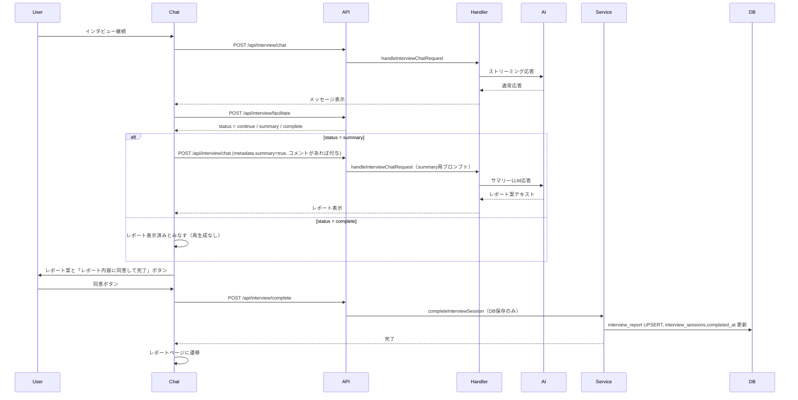

# 法案インタビュー機能 実装計画

## 概要

法案インタビュー機能を実装します。AIが事前定義された質問を会話の流れに応じて適切なタイミングで投げかけ、ユーザーの回答を収集します。インタビュー終了時にレポートを生成し、チャット画面内で表示してユーザーの同意を得ます。レポート提案は既存の `/api/interview/chat` を summary 用メタデータ付きで呼び分けて行い、DB保存は `/api/interview/complete` のみで実施します（summaryフェーズでは保存しない）。

## 要件

### インタビューフロー
- AIが会話の流れに応じて適切なタイミングで質問を選んで投げかける（ai-driven）
- クイックリプライを選択したら、そのまま送信（追加のテキスト入力は不要）
- **クイックリプライ表示**: AIが質問を投げかけた時に、その質問に紐づくクイックリプライを表示
- **セッション再開**: 中断したインタビューを再開する際、既存のメッセージ履歴を表示

### レポート生成
- レポート内容は、一旦チャットの最後に出力して、ユーザーに内容の同意を取る
- レポート提案時に「レポート内容に同意して完了」ボタンを表示
- ユーザーが完了ボタンを押したら、レポートを保存してインタビューを完了
- インタビュー終了後はレポートページに遷移
- **レポート生成タイミング**:
  - 質問が全部完了したタイミング
  - AIがこれ以上の知見収集を望めないと判断したタイミング
  - ユーザーが終了を望んだタイミング
- **エラー処理**: レポート生成に失敗した場合はエラーメッセージ表示

### レポートページ
- レポート内容のみを表示（セッション情報やメッセージ履歴は表示しない）

## 実装フェーズ

### Phase 1: データアクセス層の実装

#### 1.1 インタビュー質問取得API
- **ファイル**: `web/src/features/interview-config/api/get-interview-questions.ts`
- **内容**: `interview_config_id`から質問一覧を取得（`question_order`でソート）
- **参考**: `admin/src/features/interview-config/api/get-interview-questions.ts`

#### 1.2 インタビューセッション管理
- **ファイル**: `web/src/features/interview-session/api/get-interview-session.ts`
  - セッション取得（中断時の再開用、GET系のみ）
- **ファイル**: `web/src/features/interview-session/actions/create-interview-session.ts`
  - セッション作成（`interview_sessions`テーブルにINSERT）
  - Server Actionとして実装
- **ファイル**: `web/src/features/interview-session/services/complete-interview-session.ts`
  - セッション完了処理（`completed_at`更新）
  - レポート保存（`interview_report`テーブルにINSERT/UPSERT）
  - インターナルな処理としてservicesに配置

#### 1.3 メッセージ履歴管理
- メッセージ保存は`/api/interview/chat`エンドポイント内で自動的に行う
- 個別のServer Actionは不要

### Phase 2: インタビュー専用APIエンドポイント

#### 2.1 インタビューチャットAPI
- **ファイル**: `web/src/app/api/interview/chat/route.ts`
- **内容**:
  - 既存の`/api/chat`を参考に、インタビュー専用の処理を実装
  - 事前定義質問を取得し、AIにコンテキストとして渡す
  - プロンプトはコード内に直接記載（Langfuseは使用しない）
  - クイックリプライの処理
  - メッセージ履歴を`interview_messages`に自動保存（ユーザー送信時とAI応答時）

#### 2.2 インタビューリクエストハンドラー
- **ファイル**: `web/src/features/interview-session/services/handle-interview-chat-request.ts`
- **内容**:
  - インタビューセッションの取得/作成
  - 事前定義質問の取得とプロンプトへの組み込み（コード内にプロンプトを記載）
  - インタビュー用LLM: 通常のストリーム応答を返す
  - メッセージ保存処理（`interview_messages`に自動保存）
  - レポート生成判定: ファシリテーターLLMの判定結果を参照して要約フェーズに移行

#### 2.3 ファシリテーターAPI / Server Action（新規）
- **ファイル（想定）**: `web/src/features/interview-session/services/facilitate-interview.ts` または `web/src/app/api/interview/facilitate/route.ts` / Server Action
- **内容**:
  - 会話履歴と質問リストを参照し、継続/要約移行/完了（`continue`/`summary`/`complete`）を判定
  - 判定のみを行い、レポート生成は行わない
  - 判定結果をクライアントが同期で受け取り、`summary` 判定時に既存の `/api/interview/chat` を summary 用メタデータ付きで再呼び出して要約案を生成・表示する
  - `complete` 判定時は同意済みとみなし、 `/api/interview/complete` でDB保存する（summaryフェーズでは保存しない）

### Phase 3: インタビューチャットUI実装

#### 3.1 インタビューチャットページ
- **ファイル**: `web/src/app/bills/[id]/interview/chat/page.tsx`
- **内容**:
  - インタビュー設定と質問の取得
  - セッションの取得/作成
  - `InterviewChatClient`コンポーネントのレンダリング
  - 404処理（設定が存在しない、または非公開の場合）

#### 3.2 インタビューチャットクライアントコンポーネント
- **ファイル**: `web/src/features/interview-session/components/interview-chat-client.tsx`
- **内容**:
  - `useChat`フックを使用したチャット状態管理
  - 匿名ユーザー認証（`useAnonymousSupabaseUser`）
  - セッション管理（作成、取得）
  - クイックリプライ表示と選択処理
  - レポート表示と完了UI

#### 3.3 インタビューメッセージコンポーネント
- **ファイル**: `web/src/features/interview-session/components/interview-message.tsx`
- **内容**:
  - メッセージ表示（既存の`UserMessage`、`SystemMessage`を参考）
  - クイックリプライボタンの表示とクリック処理

#### 3.4 インタビューレポートコンポーネント
- **ファイル**: `web/src/features/interview-session/components/interview-report.tsx`
- **内容**:
  - レポート内容の表示（summary, stance, role, role_description, opinions）
  - 「レポート内容に同意して完了」ボタン
  - 修正依頼ボタン（チャットで修正内容を伝えてもらう）
  - 完了ボタン押下時に`complete-interview-session`を呼び出し、レポートページに遷移

#### 3.5 インタビューレポートページ
- **ファイル**: `web/src/app/bills/[id]/interview/report/[sessionId]/page.tsx`
- **内容**:
  - 完了したインタビューのレポートを表示
  - セッションIDからレポートを取得
  - 404処理（レポートが存在しない場合）

### Phase 4: 型定義とバリデーション

#### 4.1 型定義
- **ファイル**: `web/src/features/interview-session/types/index.ts`
- **内容**:
  - `InterviewSession`型
  - `InterviewMessage`型
  - `InterviewReport`型
  - `InterviewChatMetadata`型（`ChatMessageMetadata`を拡張）

#### 4.2 Zodスキーマ

### Phase 5: プロンプト設計（コード内記載）

#### 5.1 インタビュー用プロンプト
- **ファイル**: `web/src/features/interview-session/services/handle-interview-chat-request.ts`
- **内容**: プロンプトをコード内に直接記載
- **プロンプト変数**:
  - `billName`: 法案名
  - `billTitle`: 法案タイトル
  - `billSummary`: 法案要約
  - `billContent`: 法案詳細内容
  - `themes`: インタビューテーマ（配列）
  - `knowledgeSource`: 知識ソース
  - `questions`: 事前定義質問（JSON形式）
- **プロンプト内容**:
  - インタビューの目的と役割
  - 事前定義質問の使用方法（会話の流れに応じて適切なタイミングで使用）
  - クイックリプライの処理方法
  - **ファシリテーターLLMによる終了判定**: 継続/要約/完了を判定（トークン付与は行わない）。`summary` 判定時はチャットAPIを metadata.summary=true で呼び、要約プロンプトに切替える
  - 要約案生成はチャットAPIで行い、DB保存はしない（同意後に `/api/interview/complete` で保存）

#### 5.2 レポート生成プロンプト
- **ファイル**: `web/src/features/interview-session/services/complete-interview-session.ts`
- **内容**: インタビュー履歴からレポートを生成するためのプロンプトをコード内に記載
- **出力形式**: JSON（summary, stance, role, role_description, opinions）
- **ファイル**: `web/src/features/interview-session/types/schemas.ts`
- **内容**:
  - レポート生成結果のバリデーション
  - メッセージ保存時のバリデーション

## 技術的な詳細

### セッション管理フロー



### メッセージ保存フロー



### レポート生成と完了フロー



## 実装のポイント

1. **既存チャット機能の再利用**: `useChat`フック、`ChatWindow`コンポーネントの構造を参考にする
2. **セッション永続化**: ページリロード時もセッションを維持し、中断したインタビューを再開可能にする
3. **メッセージ履歴表示**: セッション再開時に既存のメッセージ履歴を表示
4. **クイックリプライ**: 
   - AIが質問を投げかけた時に、その質問に紐づくクイックリプライを表示
   - 選択時にそのまま送信されるUI（ボタンクリックで即座にメッセージ送信）
5. **レポート生成タイミングと経路**: 
   - 質問が全部完了 / これ以上知見収集が望めない / ユーザーが終了希望 → ファシリテーターが `summary` 判定
   - `summary` 判定時、既存 `/api/interview/chat` を metadata.summary=true で呼び、要約プロンプトに切替えてレポート案を返す
   - 再生成も同APIにコメント付きで再呼び出しする（DB保存は行わない）
6. **レポート表示と完了**: チャット画面内でレポート案を表示し、「レポート内容に同意して完了」ボタンで完了処理
7. **完了処理**: `/api/interview/complete`（`complete-interview-session`）でDB保存のみを実施（summaryフェーズでは保存しない）
8. **ページ遷移**: インタビュー完了後はレポートページに自動遷移
9. **プロンプト管理**: Langfuseは使用せず、プロンプトはコード内に直接記載。summary判定時はメタデータでプロンプトを切替
10. **エラーハンドリング**: 
    - セッション取得失敗、メッセージ保存失敗などの適切な処理
    - レポート生成失敗時はエラーメッセージ表示
11. **PR粒度**: 動作確認できる最小限の単位で実装を区切る

## ファイル構成

```
web/src/
├── features/
│   ├── interview-config/
│   │   └── api/
│   │       └── get-interview-questions.ts (新規)
│   └── interview-session/
│       ├── api/
│       │   └── get-interview-session.ts (新規、GET系のみ)
│       ├── actions/
│       │   └── create-interview-session.ts (新規)
│       ├── components/
│       │   ├── interview-chat-client.tsx (新規)
│       │   ├── interview-message.tsx (新規)
│       │   └── interview-report.tsx (新規)
│       ├── services/
│       │   ├── handle-interview-chat-request.ts (新規)
│       │   └── complete-interview-session.ts (新規)
│       └── types/
│           ├── index.ts (新規)
│           └── schemas.ts (新規)
└── app/
    ├── api/
    │   └── interview/
    │       └── chat/
    │           └── route.ts (新規)
    └── bills/
        └── [id]/
            └── interview/
                ├── chat/
                │   └── page.tsx (新規)
                └── report/
                    └── [sessionId]/
                        └── page.tsx (新規)
```

## 実装順序（PR粒度）

### PR1: 型定義とデータアクセス層
**目的**: データアクセス層の実装と動作確認

**実装内容**:
1. 型定義とスキーマ作成
   - `web/src/features/interview-session/types/index.ts`
   - `web/src/features/interview-session/types/schemas.ts`
2. データアクセス層の実装
   - `web/src/features/interview-config/api/get-interview-questions.ts`
   - `web/src/features/interview-session/api/get-interview-session.ts`（GET系API）
   - `web/src/features/interview-session/actions/create-interview-session.ts`（Server Action）

**動作確認**:
- セッション作成・取得が正常に動作することを確認
- 質問取得が正常に動作することを確認

---

### PR2: インタビューチャットAPI（基本機能）
**目的**: インタビューチャットAPIの基本機能実装と動作確認

**実装内容**:
1. インタビューリクエストハンドラーの実装
   - `web/src/features/interview-session/services/handle-interview-chat-request.ts`
   - プロンプトをコード内に記載
   - メッセージ保存処理（`interview_messages`に自動保存）
2. APIエンドポイントの実装
   - `web/src/app/api/interview/chat/route.ts`
   - 基本的なチャット機能（メッセージ送受信、自動保存）

**動作確認**:
- API経由でチャットが正常に動作することを確認（curl等でテスト）
- メッセージが`interview_messages`に保存されることを確認

---

### PR3: インタビューチャットUI（基本機能）
**目的**: インタビューチャットUIの基本機能実装と動作確認

**実装内容**:
1. インタビューチャットページ
   - `web/src/app/bills/[id]/interview/chat/page.tsx`
   - セッション取得/作成
   - 404処理
2. インタビューチャットクライアントコンポーネント（基本機能）
   - `web/src/features/interview-session/components/interview-chat-client.tsx`
   - `useChat`フックを使用したチャット状態管理
   - 匿名ユーザー認証
   - セッション管理（作成、取得）
   - **メッセージ履歴の表示**（セッション再開時）
3. インタビューメッセージコンポーネント（基本機能）
   - `web/src/features/interview-session/components/interview-message.tsx`
   - メッセージ表示（既存の`UserMessage`、`SystemMessage`を参考）

**動作確認**:
- チャット画面が表示されることを確認
- メッセージ送受信が正常に動作することを確認
- ページリロード時にメッセージ履歴が表示されることを確認

---

### PR4: クイックリプライ機能
**目的**: クイックリプライ機能の実装と動作確認

**実装内容**:
1. クイックリプライ表示機能
   - `interview-message.tsx`にクイックリプライボタンの表示機能を追加
   - AIが質問を投げかけた時に、その質問に紐づくクイックリプライを表示
2. クイックリプライ選択処理
   - クイックリプライボタンクリック時に、そのままメッセージ送信

**動作確認**:
- AIの質問時にクイックリプライが表示されることを確認
- クイックリプライ選択時にメッセージが送信されることを確認

---

### PR5: レポート生成と完了処理
**目的**: レポート生成と完了処理の実装と動作確認

**実装内容**:
1. レポート生成判定
   - ファシリテーター（`/api/interview/facilitate`）で `continue`/`summary`/`complete` を判定
   - `summary` 判定時に `/api/interview/chat` を metadata.summary=true で呼び、要約プロンプトに切替えてレポート案を生成（DB保存しない）
2. レポート表示コンポーネント
   - `web/src/features/interview-session/components/interview-report.tsx`
   - レポート内容の表示
   - 「レポート内容に同意して完了」ボタン
   - 修正依頼ボタン（コメントを添えて同APIを再呼び出しして再生成）
3. 完了処理サービス
   - `web/src/features/interview-session/services/complete-interview-session.ts`
   - レポート保存（`interview_report`テーブルにINSERT/UPSERT）※チャット側で生成済みテキストを保存する
   - セッション完了処理（`completed_at`更新）
4. エラーハンドリング
   - レポート生成失敗時のエラーメッセージ表示
5. レポート同意後のUIと挨拶
   - ユーザーがレポートに同意ボタンを押したら、AIがお礼の挨拶を返してインタビューを終了
   - 入力ボックスを隠し、「インタビューの提出に進む」ボタンを表示（レポート提出ページに遷移）

**動作確認**:
- レポートが適切なタイミングで提案されることを確認
- レポート内容が正しく表示されることを確認
- 完了ボタン押下時にレポートが保存され、セッションが完了することを確認
- エラー時の処理が正常に動作することを確認

---

### PR6: レポートページ
**目的**: レポートページの実装と動作確認

**実装内容**:
1. レポートページ
   - `web/src/app/bills/[id]/interview/report/[sessionId]/page.tsx`
   - セッションIDからレポートを取得
   - レポート内容のみを表示
   - 404処理（レポートが存在しない場合）
2. ページ遷移
   - インタビュー完了後にレポートページに自動遷移

**動作確認**:
- レポートページが正常に表示されることを確認
- インタビュー完了後にレポートページに遷移することを確認
- 存在しないセッションIDで404が返ることを確認

## 参考資料

- [DB設計ドキュメント](docs/20251217_1831_法案インタビュー機能DB設計.md)
- [既存チャット機能実装](web/src/features/chat/)
- [既存チャットAPI](web/src/app/api/chat/route.ts)

